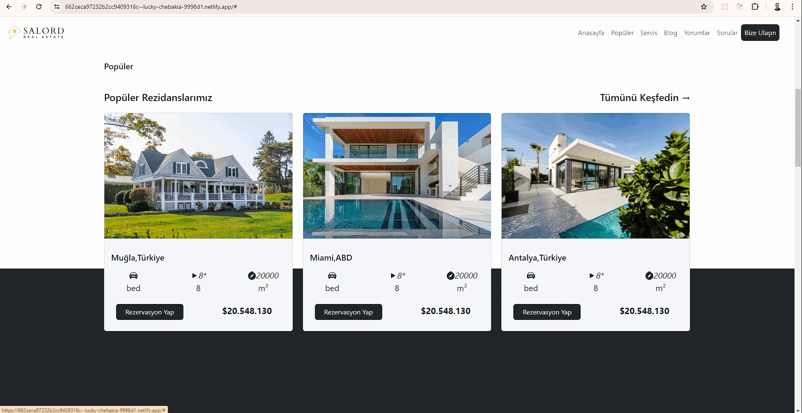

# Salord Website

## Description

This project is a responsive real estate website created using HTML, CSS, and Bootstrap. It features a clean and professional design, providing information about available properties, services, and contact details.

## Technologies Used

- HTML
- CSS
- Bootstrap

## Features

- **Responsive Design:** The website is fully responsive and works well on all devices.
- **Professional Interface:** Clean and professional layout for easy navigation.
- **Comprehensive Information:** Includes sections for properties, services, and contact information.

## How to Use

1. Clone the repository:
   ```bash
   git clone https://github.com/KamilErdogmus/BS-Salord.git
   
2. Open the index.html file in your browser to view the website.


## GIF



## Link

[Visit the Salord Website](https://662ceca97232b2cc9409316c--lucky-chebakia-9998d1.netlify.app/)
